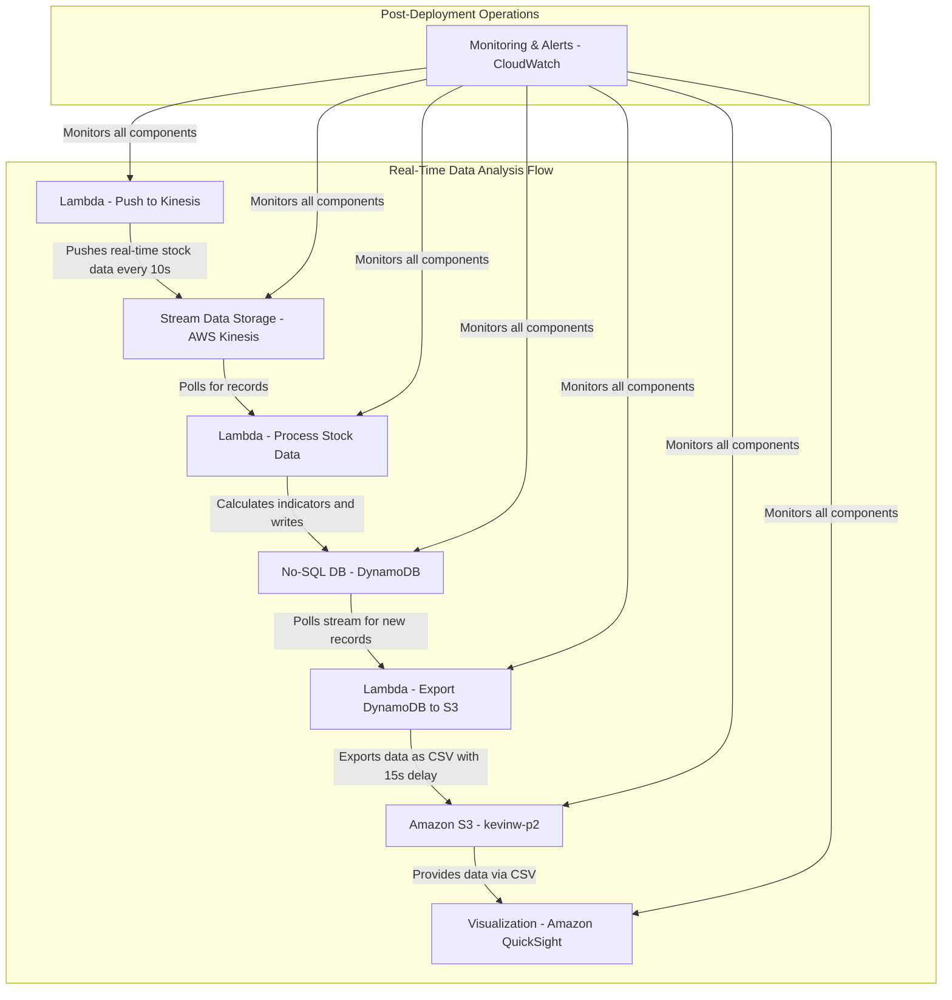

# Intelligent Stock Analysis System Documentation

## 1. Project Objectives

### 1.1 Original Objectives

- To build a real-time data processing pipeline using AWS Kinesis, DynamoDB, and Python for ingesting, processing, and storing real-time data streams.

### 1.2 Adjusted Objectives

- To develop an intelligent stock analysis system that leverages real-time data and Python-based logic to determine stock price trends. Results will be stored and visualized on Amazon QuickSight to facilitate informed investment decisions.

**Project Value Proposition**: Automated, real-time stock trend analysis to mitigate investment risks and enhance potential returns.

**Status Update (March 31, 2025)**: The system has been successfully deployed and is now ingesting real-time stock data for multiple stocks (e.g., AAPL, MSFT, GOOGL, AMZN, TSLA, NVDA). Technical indicators are calculated, trends are determined, and results are stored in DynamoDB and exported to S3 for visualization in QuickSight.

---

## 2. System Features

### 2.1 System Architecture

The system employs a serverless architecture on AWS to ingest, process, analyze, and visualize real-time stock data. It leverages AWS Lambda, Kinesis, DynamoDB, and QuickSight for scalability and cost-efficiency.



### 2.2 Component Details

- **CloudWatch Events:** Schedules the data ingestion process, triggering the `Push to Kinesis` Lambda function every 10 seconds.
- **Lambda - Push to Kinesis:** Fetches real-time stock data from the Alpha Vantage API (minute-level intraday data) for multiple stocks (AAPL, MSFT, GOOGL, AMZN, TSLA, NVDA) and publishes it to the Kinesis Data Stream. Uses the `tenacity` library for retry logic to handle API rate limits.
- **Kinesis Data Streams:** Provides a scalable and durable platform for real-time data ingestion. Configured with a single shard to handle the current data volume.
- **Lambda - Process Stock Data:** Consumes data from Kinesis, calculates technical indicators (e.g., moving averages, RSI, MACD, Bollinger Bands) using Python, and determines the stock trend (UP, DOWN, or NEUTRAL). Stores results in DynamoDB.
- **DynamoDB:** Stores processed data, including technical indicators and trend analysis results. The table schema is defined in Section 6.
- **Lambda - Export DynamoDB to S3:** Exports data from DynamoDB to a CSV file (`stock_data.csv`) in the specified S3 bucket with a 15-second delay.
- **Amazon QuickSight:** Connects to the CSV data in S3 to visualize stock price trends, technical indicators, and trend analysis results in a user-friendly dashboard.

**Updated (March 31, 2025)**:
- The `Push to Kinesis` Lambda function now uses the Alpha Vantage API (`alpha-vantage` library) instead of Yahoo Finance, providing more reliable minute-level data.
- A Lambda Layer (`stock-dependencies`) is used to manage dependencies (`alpha-vantage`, `tenacity`), ensuring compatibility with the Python 3.9 runtime.
- The system has been tested to handle real-time data for multiple stocks, with `stock_data.csv` containing non-zero volume and calculated technical indicators for stocks like TSLA and NVDA.

---

## 3. Data Flow

### 3.1 AWS Resource Mapping

| Component                  | AWS Service                          |
| :------------------------- | :----------------------------------- |
| Data Ingestion Scheduler   | CloudWatch Events                    |
| Data Ingestion             | AWS Lambda (`Push to Kinesis`)       |
| Real-time Data Stream      | AWS Kinesis Data Streams             |
| Data Processing & Analysis | AWS Lambda (`Process Stock Data`)    |
| Data Storage               | Amazon DynamoDB                      |
| Data Export                | AWS Lambda (`Export DynamoDB to S3`) |
| Data Visualization         | Amazon QuickSight                    |

### 3.2 Detailed Data Flow

1. **Ingestion:** CloudWatch Events triggers the `Push to Kinesis` Lambda function every 10 seconds. This function retrieves real-time stock data from the Alpha Vantage API for stocks specified in the `STOCK_SYMBOLS` environment variable (e.g., `AAPL,MSFT,GOOGL,AMZN,TSLA,NVDA`) and publishes it to the Kinesis Data Stream.
2. **Processing:** The Kinesis Data Stream invokes the `Process Stock Data` Lambda function. This function reads the data, calculates technical indicators (e.g., MA, RSI, MACD, Bollinger Bands) using Python, and determines the stock trend.
3. **Storage:** The `Process Stock Data` Lambda function writes the analysis results (indicators and trend) to the DynamoDB table (`stock-indicators`).
4. **Export:** The `Export DynamoDB to S3` Lambda function exports data from DynamoDB to a CSV file (`stock_data.csv`) in the S3 bucket `s3://kevinw-p2/stock-data/` with a 15-second delay.
5. **Visualization:** Amazon QuickSight connects to the CSV data in S3 and presents the stock price trends, technical indicators, and trend analysis results in a user-friendly dashboard.

---

## 4. S3 Bucket Structure

The S3 bucket (`kevinw-p2`) stores application code, historical data, deployment packages, and exported data.

```
s3://kevinw-p2/
├── code/
│   └── requirements.txt
├── data/
│   └── Sotck_historical_data.csv
├── lambda/
│   ├── lambda_function.zip
│   ├── push_to_kinesis.zip
│   ├── ta_lib_layer.zip
│   └── stock-dependencies.zip
├── stock-data/
│   └── stock_data.csv
└── terraform/
```

- **code/**: Contains source code dependencies.
  - `requirements.txt`: Lists Python dependencies (e.g., pandas, TA-Lib, alpha-vantage, tenacity).
- **data/**: Stores historical stock data for analysis and testing.
  - `tsla_history.csv`: Historical data for TSLA stock.
- **lambda/**: Contains deployment packages for the Lambda functions and Layers.
  - `lambda_function.zip`: Deployment package for the `Process Stock Data` Lambda function, including trend analysis logic.
  - `push_to_kinesis.zip`: Deployment package for the `Push to Kinesis` Lambda function.
  - `ta_lib_layer.zip`: Lambda Layer containing the TA-Lib technical analysis library.
  - **Added (March 31, 2025)**: `stock-dependencies.zip`: Lambda Layer containing `alpha-vantage` and `tenacity` dependencies, compatible with Python 3.9.
- **stock-data/**: Stores the exported CSV file containing real-time stock data and analysis results.
  - **Added (March 31, 2025)**: `stock_data.csv`: Exported CSV file containing real-time stock data, technical indicators, and trend analysis for multiple stocks.
- **terraform/**: Stores Terraform configuration files for infrastructure deployment.

---

## 5. Development Strategy

### 5.1 Approach

An agile, modular development approach will be used.

### 5.2 Process

1. **Minimum Viable Product (MVP):** Implement the core real-time data analysis pipeline, focusing on data ingestion, processing, storage, and visualization. Validate the Python-based trend determination logic.
2. **Iterative Development:** Enhance features in short iterations (2-3 weeks), optimizing performance and adding multi-stock support and real-time notifications.
3. **Continuous Integration and Feedback:** Incorporate user feedback throughout the development process. Maintain loose coupling between modules to enable independent scaling.
4. **Delivery:** Deploy the complete stock analysis system.

---

## 6. Product Development Roadmap

### 6.1 Phase Breakdown

- **Phase 1: Core Pipeline Validation** (Done)
  
  - **Objective:** Validate the end-to-end data analysis pipeline.
  - **Features:** Real-time analysis and trend determination for a single stock (e.g., TSLA) using Python logic.
  - Tech Stack:
    - Lambda (Data Ingestion)
    - Kinesis (Stream Processing)
    - Lambda (Technical Indicator Calculation & Trend Determination)
    - DynamoDB (Data Storage)
    - QuickSight (Data Visualization)
  - **Deliverables:** Validated end-to-end data analysis pipeline.
  
- **Phase 2: Multi-Stock Support & Notifications**
  - **Objective:** Extend the system to support multiple stocks and implement real-time price fluctuation alerts.
  - Features:
    - Multi-stock data handling in Kinesis and Lambda.
    - Multi-stock trend visualization in QuickSight.
    - Integration with AWS SNS for real-time price fluctuation alerts.
  - **Deliverables:** Multi-stock support and real-time notifications.
  
- **Phase 3: System Optimization**
  - **Objective:** Optimize system performance and scalability.
  - Features:
    - Kinesis shard optimization.
    - Lambda concurrency tuning.
    - DynamoDB throughput optimization.
    - Enhanced QuickSight interactivity.
  - **Deliverables:** Optimized and scalable system.
  
  ### The Final
  
  ```mermaid
  graph TD;
      subgraph Real-Time Data Analysis Flow
          A[Lambda - Push to Kinesis] -->|Pushes real-time stock data| B[Stream Data Storage - AWS Kinesis];
          B -->|Triggers processing| C[Serverless Function A - AWS Lambda];
          C -->|Calculates indicators and invokes prediction| D[Machine Learning Predict Model - SageMaker Endpoint];
          D -->|Returns prediction result| C;
          C -->|Writes processed data| F[No-SQL DB - DynamoDB];
          F -->|Streams new records| E[Lambda - Export DynamoDB to S3];
          E -->|Exports data as CSV with 15s delay| I[Amazon S3kevinw-p2];
          I -->|Provides data via CSV| G[Visualization - Amazon QuickSight];
          G -->|Displays predictions| G;
      end
  
      subgraph Model Training Flow
          I[Amazon S3kevinw-p2] -->|Provides historical stock data| K[Machine Learning Training Job - SageMaker];
          J[Serverless Function B - AWS Lambda] -->|Triggers training job| K;
          K -->|Stores trained model| I;
          K -->|Updates endpoint with new model| D;
      end
  
      subgraph Post-Deployment Operations
          M[Monitoring & Alerts - CloudWatch] -->|Monitors all components| A;
          M -->|Monitors all components| B;
          M -->|Monitors all components| C;
          M -->|Monitors all components| D;
          M -->|Monitors all components| F;
          M -->|Monitors all components| E;
          M -->|Monitors all components| I;
          M -->|Monitors all components| G;
          M -->|Monitors all components| J;
          M -->|Monitors all components| K;
          O[EventBridge Scheduling] -->|Triggers every 3 days| J;
          P[CloudWatch Events] -->|Triggers every 10 seconds| A;
      end
  ```
  
  

### 6.2 DynamoDB Table Schema

Table Name: `stock-indicators`

Primary Key:

- Partition Key (Hash Key): `symbol` (String) - Stock Symbol
- Sort Key (Range Key): `timestamp` (String) - ISO format timestamp

Attributes:

```json
{
    "symbol": "String",              // Stock Symbol (e.g., "TSLA")
    "timestamp": "String",           // ISO format timestamp (e.g., "2025-03-28T15:59:00Z")
    "open": "Number",                // Opening Price
    "high": "Number",                // Highest Price
    "low": "Number",                 // Lowest Price
    "close": "Number",               // Closing Price
    "volume": "Number",              // Trading Volume
    "MA_5": "Number",                // 5-period Moving Average
    "MA_20": "Number",               // 20-period Moving Average
    "MA_50": "Number",               // 50-period Moving Average
    "RSI": "Number",                 // Relative Strength Index
    "MACD": "Number",                // MACD
    "MACD_Signal": "Number",         // MACD Signal Line
    "BB_Upper": "Number",            // Bollinger Bands Upper
    "BB_Lower": "Number",            // Bollinger Bands Lower
    "BB_Middle": "Number",           // Bollinger Bands Middle
    "Stoch_K": "Number",             // Stochastic Oscillator %K
    "Stoch_D": "Number",             // Stochastic Oscillator %D
    "prediction": "String",          // Predicted Trend ("UP"/"DOWN"/"NEUTRAL")
    "confidence": "Number",          // Confidence Level (0-100)
    "strength": "String"             // Trend Strength ("STRONG"/"MODERATE"/"WEAK")
}
```

---

## 7. Implementation Details

### 7.1 Lambda Function Configurations

- **Push to Kinesis**:
  - **Runtime**: Python 3.9
  - **Environment Variables**:
    - `KINESIS_STREAM_NAME`: `stock-stream`
    - `STOCK_SYMBOLS`: `AAPL,MSFT,GOOGL,AMZN,TSLA,NVDA`
    - `ALPHA_VANTAGE_API_KEY`: [Your Alpha Vantage API Key]
  - **Dependencies**: Managed via Lambda Layer `stock-dependencies` (includes `alpha-vantage`, `tenacity`).
  - **Trigger**: CloudWatch Events (every 10 seconds).
  - **Functionality**: Fetches minute-level intraday data from Alpha Vantage API and pushes it to Kinesis.

- **Process Stock Data**:
  - **Runtime**: Python 3.9
  - **Dependencies**: Managed via Lambda Layer `stock-dependencies` and `ta_lib_layer`.
  - **Trigger**: Kinesis Data Stream (`stock-stream`).
  - **Functionality**: Calculates technical indicators and stores results in DynamoDB.

- **Export DynamoDB to S3**:
  - **Runtime**: Python 3.9
  - **Trigger**: Scheduled (every 15 seconds).
  - **Functionality**: Exports DynamoDB data to `s3://kevinw-p2/stock-data/stock_data.csv`.

### 7.2 Challenges and Resolutions

- **Challenge**: `tenacity` and `alpha_vantage` modules were initially missing, causing `ModuleNotFoundError`.
  - **Resolution**: Created a Lambda Layer (`stock-dependencies`) with `alpha-vantage` and `tenacity`, built using Python 3.9 in a Docker container to ensure compatibility.
- **Challenge**: `JSONDecodeError` in `Push to Kinesis` due to incorrect parsing of `STOCK_SYMBOLS` environment variable.
  - **Resolution**: Updated the code to use `split(',')` instead of `json.loads()` to parse the comma-separated `STOCK_SYMBOLS` value.
- **Challenge**: Insufficient data for technical indicator calculation (e.g., NVDA had only 4 records, less than the required 30).
  - **Resolution**: Switched to Alpha Vantage API for minute-level data (100 records per call) and adjusted the minimum data requirement in `Process Stock Data` to 10 records.

---

## 8. Next Steps

- **Implement Real-Time Notifications**: Integrate AWS SNS to send price fluctuation alerts for significant stock movements.
- **Optimize System Performance**:
  - Increase Kinesis shards if data volume grows.
  - Tune Lambda concurrency to handle higher throughput.
  - Optimize DynamoDB read/write capacity.
- **Enhance QuickSight Dashboard**: Add interactive features like drill-downs and filters for better user experience.
- **Monitor and Scale**: Use CloudWatch to monitor system performance and scale resources as needed.

---

## 9. Conclusion

The Intelligent Stock Analysis System has been successfully deployed as of March 31, 2025. It provides real-time stock trend analysis for multiple stocks, with data stored in DynamoDB and visualized in QuickSight. The system is ready for further enhancements, including real-time notifications and performance optimization, to deliver even greater value to users.

---

